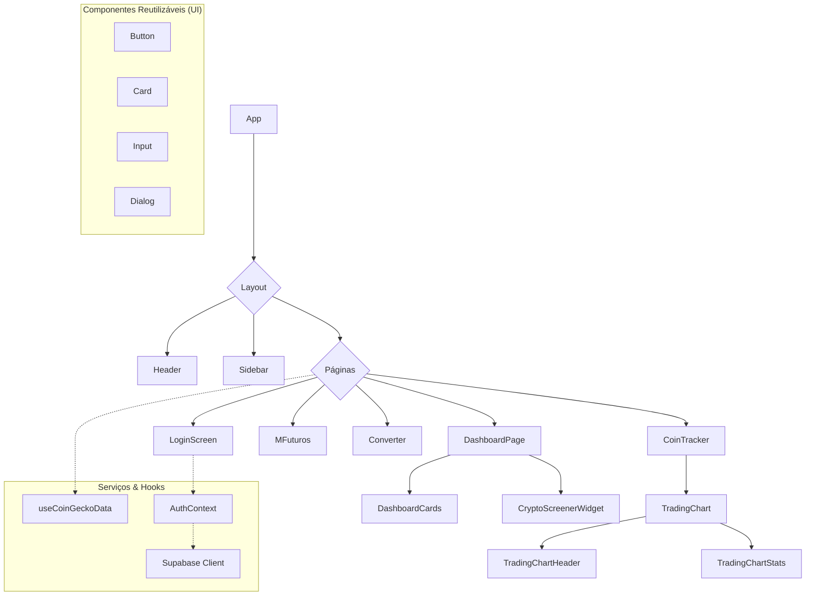

# Cripto Glass 💎


<p align="center">
  
  
  
  
  
</p>

<p align="center">
  <strong>Cripto Glass é uma plataforma moderna e intuitiva para rastreamento e análise de criptomoedas em tempo real, oferecendo ferramentas avançadas para traders e entusiastas.</strong>
</p>

---

## ✨ Funcionalidades

- **📊 Dashboard Interativo:** Visualize as principais métricas do mercado, seus investimentos e as moedas em alta.
- **📈 Rastreamento em Tempo Real:** Acompanhe o preço de centenas de criptomoedas com dados ao vivo.
- **💹 Ferramentas de Day Trade:** Sistema dedicado para operações de curto prazo com análises técnicas.
- **🧮 Calculadora de Alavancagem:** Simule operações em mercados futuros com diferentes níveis de alavancagem.
- **🔄 Conversor de Moedas:** Converta facilmente entre diferentes criptomoedas e moedas fiduciárias.
- **🔐 Autenticação Segura:** Gerenciamento de contas de usuário com Supabase.
- **📱 Design Responsivo:** Experiência de usuário otimizada para desktops e dispositivos móveis.

---

## 🛠️ Tecnologias Utilizadas

O projeto é construído com um conjunto de tecnologias modernas e eficientes:

- **Frontend:** [React](https://react.dev/), [TypeScript](https://www.typescriptlang.org/), [Vite](https://vitejs.dev/)
- **Estilização:** [Tailwind CSS](https://tailwindcss.com/), [Shadcn/UI](https://ui.shadcn.com/)
- **Gráficos e Visualização:** [Recharts](https://recharts.org/), [TradingView Widgets](https://www.tradingview.com/widget/)
- **Backend & Autenticação:** [Supabase](https://supabase.com/)
- **Gerenciamento de Estado:** [React Query](https://tanstack.com/query/latest)
- **Roteamento:** [React Router](https://reactrouter.com/)
- **Linting & Formatação:** [ESLint](https://eslint.org/)

---

## 🏗️ Arquitetura do Projeto

Abaixo está um diagrama simplificado da arquitetura de componentes do Cripto Glass:



---

## 🚀 Começando

Siga os passos abaixo para executar o projeto em seu ambiente local.

**Pré-requisitos:**
- [Node.js](https://nodejs.org/en/) (versão 18 ou superior)
- [Bun](https://bun.sh/) ou [NPM](https://www.npmjs.com/)/[Yarn](https://yarnpkg.com/)

**1. Clone o repositório:**
```bash
git clone https://github.com/Cryptolife020/cripto-glass.git
cd cripto-glass
```

**2. Instale as dependências:**
```bash
npm install
```

**3. Configure as variáveis de ambiente:**
- Renomeie o arquivo `.env.example` para `.env`.
- Adicione suas chaves da API do Supabase e outras configurações necessárias.
```
VITE_SUPABASE_URL=sua_url_aqui
VITE_SUPABASE_ANON_KEY=sua_chave_anon_aqui
```

**4. Execute o servidor de desenvolvimento:**
```bash
npm run dev
```

Abra [http://localhost:5173](http://localhost:5173) (ou a porta indicada no seu terminal) no seu navegador para ver o resultado.

---

## 📜 Licença

Este projeto está licenciado sob a Licença MIT. Veja o arquivo `LICENSE` para mais detalhes.

---

<p align="center">
  Feito com ❤️ por <a href="https://github.com/Cryptolife020">Cryptolife020</a>
</p>
